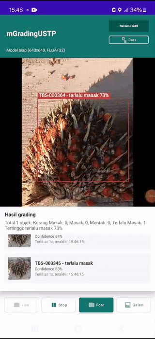
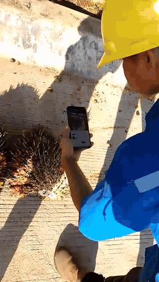
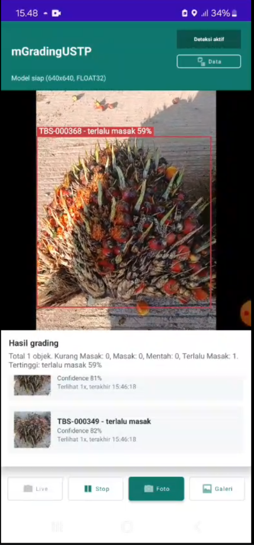
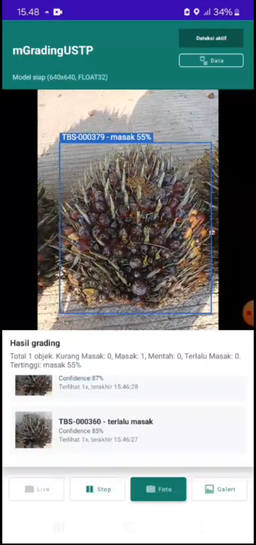
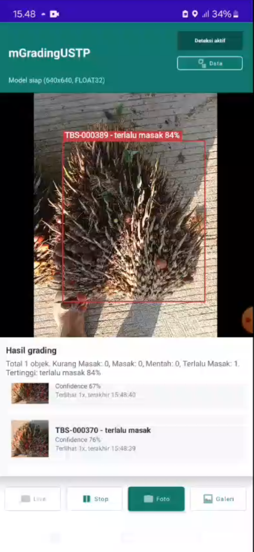
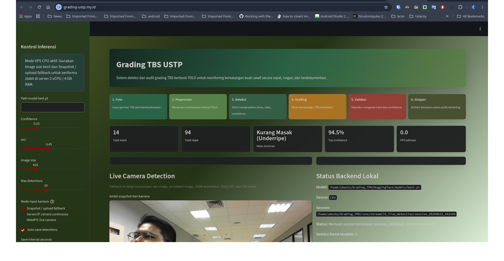
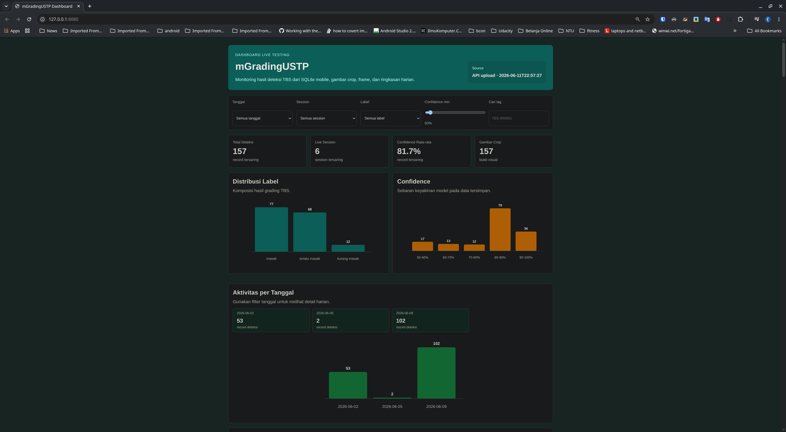
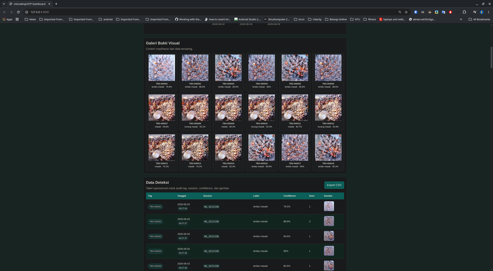
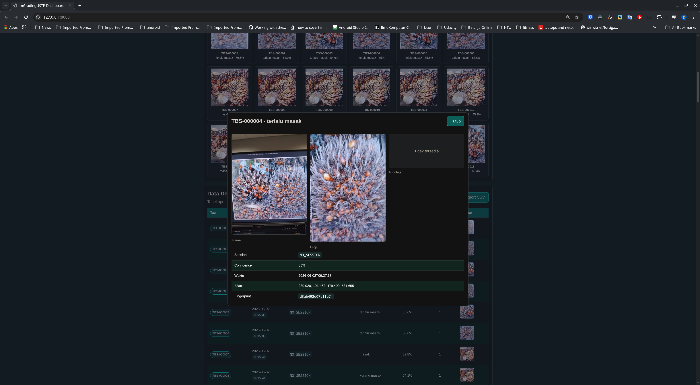

# 🌴 Automatic Grading TBS AI Computer Vision

Repository monorepo ini berisi project **Automatic Grading TBS (Tandan Buah Segar) Kelapa Sawit** berbasis AI Computer Vision. Sistem memakai YOLO untuk deteksi/grading, aplikasi Android untuk demo mobile offline, Streamlit untuk demo web inference, dan dashboard backend untuk menerima data upload dari mobile.

## 🚀 Live Demo

| Komponen | Link |
|---|---|
| Streamlit Grading TBS | <https://grading-ustp.my.id/> |
| Dashboard Upload Mobile | <https://dashboard-grading-ustp.my.id/> |

## 🖼️ Demo Screenshots

Media demo berikut berasal dari folder `readme_assets/demo/mobile`, `readme_assets/demo/dashboard`, dan `readme_assets/demo/streamlite`.

### 📱 Demo Mobile











### 🌐 Demo Streamlit




### 📊 Demo Dashboard







## 🧩 Komponen Project

| Folder | Isi | Status |
|---|---|---|
| `training-yolo/` | Notebook training, EDA, konfigurasi dataset, dokumentasi evaluasi, CSV metrik, dan artifact visual hasil training YOLO. | Siap dibaca |
| `streamlit-demo/` | Aplikasi Streamlit CPU-only untuk demo publik dan inference web. | Siap jalan lokal/deploy |
| `android-mobile-demo/` | Aplikasi Android native untuk live detection offline menggunakan CameraX, TensorFlow Lite, overlay bounding box, tagging, dan SQLite lokal. | Siap build jika model TFLite lokal tersedia |
| `dashboard-nodejs/` | Dashboard web dan backend upload untuk menerima data deteksi dari aplikasi Android. Implementasi saat ini memakai static frontend dan backend Python standard-library. | Siap jalan lokal/deploy |
| `presentasi/` | File presentasi project. | Siap |
| `release-apk/` | APK lokal yang dipisahkan dari source tree. | Lokal saja, tidak ikut Git |

## 📁 Struktur Repository

```text
Grading_TBS_CV_KEL_A_Github/
├── training-yolo/
│   ├── notebooks/
│   ├── dataset/
│   └── docs/
├── streamlit-demo/
│   ├── app.py
│   ├── requirements.txt
│   ├── Huggingface/models/best.pt
│   └── docs/
├── android-mobile-demo/
│   ├── app/
│   ├── gradle/wrapper/
│   ├── docs/
│   ├── readme_assets/
│   └── README.md
├── dashboard-nodejs/
│   ├── public/
│   ├── server/
│   ├── deploy/
│   ├── docs/
│   └── README.md
├── presentasi/
├── readme_assets/
│   └── demo/
├── release-apk/
├── README.md
└── .gitignore
```

## 🧠 Training YOLO

Folder `training-yolo/` berisi notebook dan dokumentasi training model grading TBS. Dataset penuh tidak dimasukkan ke repository karena ukurannya besar, tetapi metadata dataset tetap tersedia di `training-yolo/dataset/`.

File penting:

- `training-yolo/notebooks/Grading_TPH-Copy1.ipynb`
- `training-yolo/notebooks/Grading_TPH_EDA_and_Hyperparameter_tunning.ipynb`
- `training-yolo/dataset/data.yaml`
- `training-yolo/docs/dokumentasi_grading_tbs.md`
- `training-yolo/docs/evaluation-artifacts/`

Ringkasan performa dari dokumentasi training:

| Metrik | Nilai |
|---|---:|
| Test precision | 93.12% |
| Test recall | 94.65% |
| Test mAP50 | 97.54% |
| Test mAP50-95 | 76.57% |
| Optimizer terbaik benchmark | MuSGD |

## 🌐 Streamlit Demo

Folder `streamlit-demo/` berisi aplikasi demo web CPU-only. Model final kecil untuk demo Streamlit disertakan di:

```text
streamlit-demo/Huggingface/models/best.pt
```

Jalankan lokal:

```bash
cd streamlit-demo
python3 -m venv .venv-streamlit-cpu
source .venv-streamlit-cpu/bin/activate
pip install --upgrade pip
pip install -r requirements.txt
./start_cpu_only.sh
```

Buka:

```text
http://127.0.0.1:8501
```

## 📱 Android Mobile Demo

Folder `android-mobile-demo/` berisi aplikasi Android native `mGradingUSTP`. Aplikasi ini mendukung:

- live camera detection menggunakan CameraX;
- mode Foto dan Galeri;
- bounding box, label grading, confidence, dan tag `TBS-000001`;
- penyimpanan SQLite lokal;
- upload/sync data ke dashboard backend.

Model TFLite Android tidak ikut dipush. Sebelum build, letakkan model lokal di:

```text
android-mobile-demo/app/src/main/assets/grading_tph_int8.tflite
```

Build debug:

```bash
cd android-mobile-demo
cp /path/to/grading_tph_int8.tflite app/src/main/assets/grading_tph_int8.tflite
JAVA_HOME=/usr/lib/jvm/java-17-openjdk ./gradlew assembleDebug
```

APK lama dipisahkan secara lokal di:

```text
release-apk/mGrading_RPP_09062026_alpha_test.apk
```

Folder `release-apk/` sengaja di-ignore agar APK tidak ikut push ke GitHub.

## 📊 Dashboard Backend

Folder `dashboard-nodejs/` berisi dashboard web dan backend upload. Nama folder mengikuti rencana awal, tetapi implementasi saat ini bukan Node.js; backend memakai Python standard-library di `server/server.py`.

Jalankan lokal:

```bash
cd dashboard-nodejs
python3 server/server.py
```

Buka:

```text
http://127.0.0.1:8080
```

Endpoint utama:

```text
GET  /api/health
GET  /api/dashboard-data
POST /api/detections
```

Android cukup diarahkan ke base URL dashboard, misalnya:

```text
https://dashboard-grading-ustp.my.id
```

Aplikasi Android akan menambahkan path `/api/detections` sendiri.

## 🎞️ Presentasi

File presentasi utama dapat dibuka melalui PDF berikut:

[Buka Presentasi PDF](presentasi/Final_Project_CV_KEL_A_Raden_Saleh_Project_Automatic_Grading_TBS_AI.pdf)

Media demo README disimpan di:

```text
readme_assets/demo/
```

## 📦 Catatan File Besar

File berikut sengaja tidak dimasukkan ke GitHub:

- dataset gambar penuh;
- video mentah;
- hasil training lengkap;
- database SQLite runtime;
- folder upload dashboard;
- virtual environment;
- APK;
- model TFLite Android;
- cache dan build output.

Repository hanya membawa source code, notebook utama, metadata dataset, dokumentasi, artifact evaluasi terpilih, sample dashboard data, model final kecil untuk Streamlit, dan screenshot demo untuk README.

## ✍️ Penulis

Ridwan Pioneer Panjaitan

LinkedIn: <https://www.linkedin.com/in/piopanjaitan/>
