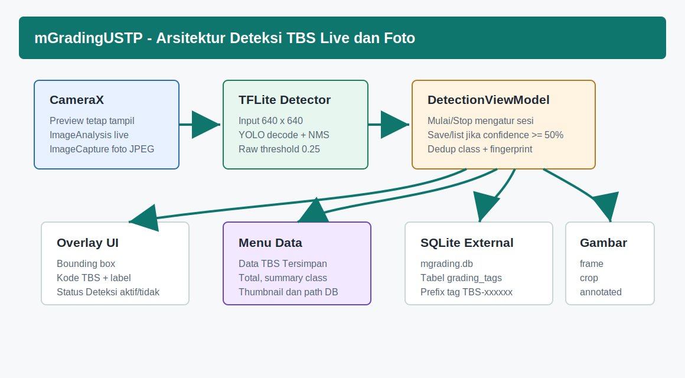
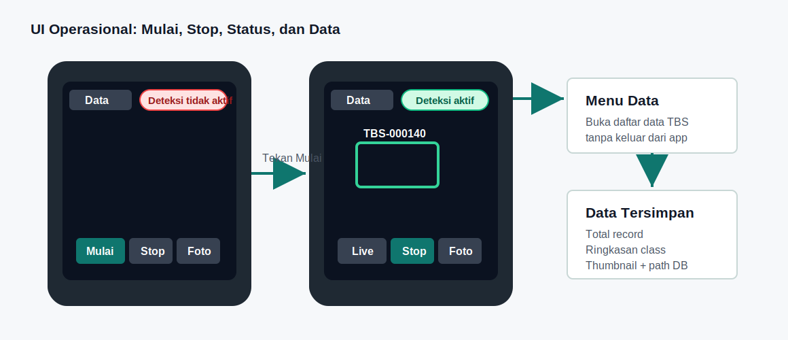

# mGradingUSTP - Dokumentasi Perencanaan Aplikasi Mobile TBS

Tanggal dokumen: 9 Juni 2026  
Lokasi project: `/mnt/pioneer/Project_GradingTph_Mobile`

## 1. Tujuan Project

`mGradingUSTP` adalah aplikasi Android offline untuk membantu user lapangan mendeteksi grading Tandan Buah Segar (TBS) dan berondolan menggunakan kamera mobile. App mendukung dua cara kerja: live detection dari kamera dan detection dari foto.

## 2. Skenario Utama User

| Tahap | Aksi user | Output app |
| --- | --- | --- |
| Buka app | User membuka kamera | Preview tampil, status `Deteksi tidak aktif`. |
| Mulai live | User tekan `Mulai` | Status menjadi `Deteksi aktif`; app mulai membaca frame. |
| Baca TBS satu per satu | User mengarahkan kamera ke tiap TBS | Jika confidence `>=50%`, tag `TBS-xxxxxx` muncul dan data tersimpan. |
| Pindah objek | User mengarah ke TBS lain | Tag baru dibuat jika objek belum pernah tersimpan. |
| Kembali objek lama | User mengarah lagi ke objek yang sama | Tag lama langsung muncul, record baru tidak dibuat. |
| Zoom out | User melihat seluruh tumpukan TBS | Beberapa objek valid tampil dengan tag masing-masing. |
| Ambil foto | User tekan `Foto` | Foto beranotasi disimpan. |
| Audit data | User tekan `Data` | Form/list data TBS tersimpan ditampilkan. |
| Berhenti | User tekan `Stop` | Deteksi berhenti dan status menjadi `Deteksi tidak aktif`. |

## 3. Kebutuhan Fitur

| Fitur | Prioritas | Status |
| --- | --- | --- |
| Live camera detection manual start/stop | P0 | Implemented |
| Status deteksi kanan atas | P0 | Implemented |
| Auto tag TBS dengan threshold 50% | P0 | Implemented |
| Simpan frame/crop/foto anotasi | P0 | Implemented |
| SQLite external `mgrading.db` | P0 | Implemented |
| Menu dan form daftar data tersimpan | P0 | Implemented |
| Dedup objek sama | P0 | Implemented dengan fingerprint |
| Export/sinkronisasi data keluar aplikasi | P1 | Belum menjadi scope saat ini |
| Training ulang model dengan data lapangan tambahan | P1 | Direkomendasikan setelah pengumpulan data |

## 4. Rancangan UX Operasional

- Tombol `Mulai` wajib ditekan sebelum deteksi berjalan agar app tidak langsung menyimpan data saat user baru membuka kamera.
- Tombol `Stop` menghentikan deteksi tanpa menutup kamera.
- Status kanan atas memberi feedback cepat: `Deteksi aktif` atau `Deteksi tidak aktif`.
- Tombol `Data` berada di layar kamera agar user bisa audit hasil tanpa mencari file database manual.
- Kontrol bawah memakai safe area agar tidak tertimpa navigation bar Android.

## 5. Rencana Data dan Storage

| Data | Lokasi |
| --- | --- |
| SQLite | `/sdcard/Android/data/com.ustp.mgrading/files/Documents/mgrading.db` |
| Gambar | `/sdcard/Android/data/com.ustp.mgrading/files/Pictures/grading/YYYYMMDD/` |
| Tag | `TBS-000001`, `TBS-000002`, dan seterusnya |
| Record utama | `grading_tags` |

## 6. Rencana Validasi Lapangan

| Uji | Kriteria berhasil |
| --- | --- |
| Objek tunggal | Tag muncul saat confidence `>=50%`. |
| Objek banyak | Lebih dari satu TBS bisa diberi tag pada satu frame/foto. |
| Objek sama | Tidak membuat record duplikat saat kamera masih melihat objek yang sama. |
| Objek lama | Tag lama muncul saat user kembali ke objek yang sudah pernah tersimpan. |
| Stop detection | Setelah `Stop`, tidak ada deteksi dan tidak ada record baru. |
| Data page | Total data, summary kelas, dan thumbnail tampil. |
| Storage | File `mgrading.db` dan gambar bisa ditemukan di external app-specific storage. |

## 7. Roadmap Lanjutan

| Tahap | Rencana |
| --- | --- |
| v1.1 | Export CSV/ZIP untuk database dan gambar. |
| v1.2 | Filter tanggal, session, dan label pada halaman Data. |
| v1.3 | Sinkronisasi server jika perangkat online. |
| v1.4 | Training ulang TFLite dari data real lapangan yang sudah dikumpulkan. |
