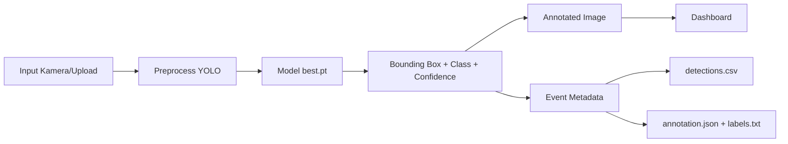
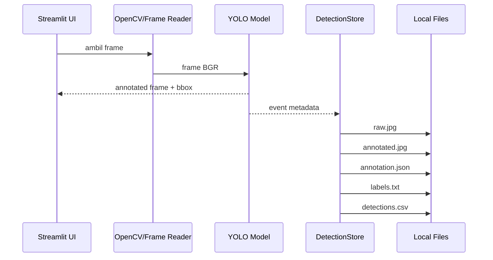

# Dokumentasi Streamlit Live Dashboard Grading TBS YOLO

Panduan teknis, fungsi kode, mode deteksi, penyimpanan audit, dan deployment publik  
Generated: `2026-06-17 15:12:50`

## Ringkasan

Dashboard Streamlit ini dipakai untuk menjalankan inferensi YOLO pada TBS, menampilkan hasil deteksi, menyimpan gambar raw, gambar annotated, JSON annotation, YOLO TXT, dan CSV event. Untuk akses publik gratis, dashboard dapat dibuka lewat Cloudflare Quick Tunnel. Karena WebRTC live camera tidak stabil lewat Cloudflare/VPN tanpa TURN relay, dashboard sekarang menyediakan mode **Server/IP camera continuous** agar deteksi live dapat berjalan terus menerus dari kamera yang bisa dibaca server.

## Arsitektur Proses



## Mode Input dan Deployment

| Mode | Input | Stabilitas Public | Auto-save | Kapan Dipakai |
| --- | --- | --- | --- | --- |
| Snapshot / upload fallback | Browser camera snapshot atau upload file | Sangat stabil via Cloudflare | Ya, saat tombol snapshot/upload diproses | Demo publik, validasi cepat, audit gambar |
| Server/IP camera continuous | Webcam server, file video, RTSP/IP camera | Stabil via Cloudflare karena tidak memakai WebRTC browser | Ya, berkala sesuai save interval | Live monitoring publik dengan kamera di server/kebun/CCTV |
| WebRTC live camera | Kamera browser user | Tidak stabil via Cloudflare/VPN tanpa TURN | Ya, jika koneksi WebRTC berhasil | LAN/localhost/HTTPS langsung atau publik dengan TURN |
| HTTPS LAN/VPN | Akses langsung ke Streamlit server | Stabil jika semua client masuk jaringan/VPN | Sesuai mode yang dipilih | Demo internal, jaringan kampus/perusahaan |
| Gradio Hugging Face | Upload/webcam di Space | Publik, cocok untuk demo model | Tergantung implementasi Space | Showcase publik tanpa menghidupkan server lokal |

## Grafik Dinamis di HTML

Versi HTML dokumentasi ini memiliki grafik interaktif untuk membandingkan stabilitas mode input, reliabilitas auto-save, dan cakupan fungsi. Versi Markdown menyediakan diagram Mermaid, sementara PDF menyediakan grafik statis.

## Cara Menjalankan

| Skenario | Command |
| --- | --- |
| LAN standar | `streamlit run Streamlit/app.py --server.address 0.0.0.0 --server.port 8501` |
| LAN HTTPS | `python Streamlit/run_secure.py` |
| Public proxy gratis | `./Streamlit/start_public_proxy.sh` |
| Public continuous source | `STREAMLIT_CAMERA_SOURCE=0 ./Streamlit/start_public_proxy.sh` |

### Public Proxy Cloudflare

1. Jalankan `./Streamlit/start_public_proxy.sh`.
2. Tunggu URL `https://*.trycloudflare.com` muncul.
3. Buka URL tersebut dari browser publik.
4. Untuk demo stabil, pilih `Snapshot / upload fallback` atau `Server/IP camera continuous`.
5. Untuk `Server/IP camera continuous`, isi source kamera seperti `0`, path video lokal, atau `rtsp://user:pass@ip:554/stream`.
6. Klik `Start Continuous` dan atur `Save interval seconds`.

### Catatan WebRTC

`WebRTC live camera` memakai kamera browser user. Mode ini bisa berjalan di localhost, HTTPS LAN, atau akses langsung VPN. Untuk publik lewat Cloudflare/VPN, mode ini sering gagal karena ICE/STUN tidak bisa membentuk jalur media. Agar stabil di publik, perlu TURN relay.

## Output dan Struktur Data

Output session berada di:

```text
runs/streamlit_live_detection/session_YYYYmmdd_HHMMSS/
```

| File | Isi | Keterangan |
| --- | --- | --- |
| detections.csv | Tabel seluruh event | timestamp, event_id, path, model, device, threshold, total_detections, class_distribution, boxes_json |
| det_00001_raw.jpg | Gambar input asli | Dipakai audit dan retraining |
| det_00001_annotated.jpg | Gambar hasil prediksi | Bounding box + label + confidence |
| det_00001_annotation.json | Anotasi lengkap | Metadata event, ukuran gambar, daftar bbox xyxy |
| det_00001_labels.txt | Format YOLO | class_id x_center y_center width height normalized |

## Fungsi Kode

### Ringkasan Kelompok Fungsi

- **UI & Theme**: `style_plotly`, `apply_page_style`, `metric_cards`, `process_strip`, `render_charts`, `render_detail_panel`, `main`
- **Model & Device**: `resolve_model_path`, `load_model`, `get_device`, `format_device_name`
- **Detection Pipeline**: `run_yolo_detection`, `build_detection_event`, `detect_static_frame`, `detect_continuous_frame`, `YOLOVideoProcessor.recv`
- **Camera & WebRTC**: `get_webrtc_ice_servers`, `has_turn_server`, `normalize_capture_source`, `read_server_camera_frame`, `parse_csv_env`, `env_truthy`
- **Storage & State**: `create_session_dir`, `boxes_to_yolo_lines`, `init_session_state`, `history_to_df`, `parse_boxes`, `DetectionStore.save_event`, `DetectionStore.snapshot`, `DetectionStore.reset`, `DetectionStore.update_runtime`

### Detail Semua Fungsi dan Class

| Nama | Tipe | Line | Fungsi |
| --- | --- | --- | --- |
| style_plotly | function | 38 | Mengunci warna grafik Plotly ke light theme agar chart tetap terbaca ketika browser/Streamlit memakai dark theme. |
| env_truthy | function | 75 | Membaca environment variable boolean seperti 1, true, yes, atau on. |
| parse_csv_env | function | 79 | Mengubah environment variable berbentuk CSV menjadi list string, dipakai untuk daftar TURN URL. |
| get_webrtc_ice_servers | function | 86 | Membangun konfigurasi ICE WebRTC dari STUN/TURN environment variable. Mendukung JSON penuh atau format TURN sederhana. |
| has_turn_server | function | 114 | Mengecek apakah konfigurasi ICE sudah berisi TURN relay. |
| apply_page_style | function | 124 | Menyuntik CSS dashboard: light theme, panel, metric card, process strip, sidebar, dan warna teks yang stabil. |
| metric_cards | function | 208 | Merender KPI cards seperti total event, total objek, kelas dominan, confidence, dan estimasi FPS. |
| process_strip | function | 216 | Merender alur proses Foto -> Preprocess -> Deteksi -> Grading -> Validasi -> Simpan. |
| resolve_model_path | function | 229 | Mencari file model YOLO best.pt secara dinamis dari input manual, folder Huggingface, dan runs/detect terbaru. |
| load_model | function | 261 | Memuat model YOLO dengan cache Streamlit agar tidak reload setiap rerun. |
| get_device | function | 265 | Memilih device inferensi: CUDA jika tersedia, selain itu CPU. |
| format_device_name | function | 276 | Mengubah device internal menjadi label yang mudah dibaca di UI. |
| create_session_dir | function | 280 | Membuat folder session baru untuk output live detection. |
| boxes_to_yolo_lines | function | 286 | Mengonversi bounding box xyxy menjadi format YOLO TXT normalized xywh. |
| DetectionStore | class | 298 | Komponen class untuk state atau pemrosesan video. |
| DetectionStore.__init__ | method | 299 | Method class untuk mendukung dashboard. |
| DetectionStore.reset | method | 311 | Mengganti session output baru dan mengosongkan history deteksi. |
| DetectionStore.snapshot | method | 323 | Mengambil salinan state DetectionStore secara thread-safe untuk dirender Streamlit. |
| DetectionStore.save_event | method | 336 | Menyimpan raw image, annotated image, JSON annotation, YOLO TXT, dan append CSV event. |
| DetectionStore.update_runtime | method | 378 | Memperbarui status runtime terakhir, inference time, FPS, dan jumlah deteksi frame terakhir. |
| YOLOVideoProcessor | class | 386 | Komponen class untuk state atau pemrosesan video. |
| YOLOVideoProcessor.__init__ | method | 387 | Method class untuk mendukung dashboard. |
| YOLOVideoProcessor.recv | method | 394 | Callback stream WebRTC: menerima frame browser, menjalankan YOLO, menggambar bbox, dan auto-save event. |
| init_session_state | function | 505 | Menyiapkan DetectionStore di session state Streamlit. |
| history_to_df | function | 511 | Mengubah history event menjadi DataFrame dengan kolom tetap. |
| parse_boxes | function | 517 | Membaca boxes_json dari event menjadi DataFrame bounding box. |
| run_yolo_detection | function | 527 | Pipeline inferensi inti: menjalankan YOLO, membuat anotasi bbox, menghitung confidence, FPS, dan ringkasan kelas. |
| build_detection_event | function | 600 | Membentuk record event yang siap disimpan ke CSV/JSON dari hasil deteksi. |
| normalize_capture_source | function | 623 | Mengubah input source kamera; angka seperti 0 menjadi integer untuk OpenCV, URL/path tetap string. |
| read_server_camera_frame | function | 630 | Membaca satu frame dari webcam server, file video, atau RTSP/IP camera menggunakan OpenCV. |
| detect_static_frame | function | 643 | Menjalankan deteksi untuk snapshot/upload dan menyimpan event jika ada objek. |
| detect_continuous_frame | function | 671 | Menjalankan deteksi berulang untuk kamera server/IP camera dan menyimpan event sesuai save interval. |
| render_charts | function | 702 | Merender grafik monitoring: distribusi kelas dan timeline event. |
| render_detail_panel | function | 754 | Menampilkan detail event terpilih: gambar annotated/raw, metadata, download anotasi, dan tabel bounding box. |
| main | function | 803 | Entry point Streamlit: konfigurasi halaman, sidebar, mode input kamera, model loading, dashboard, dan refresh behavior. |

## Alur Penyimpanan Event



## Rekomendasi Operasional

- Untuk demo publik cepat: gunakan `Snapshot / upload fallback`.
- Untuk live continuous publik: gunakan `Server/IP camera continuous` dengan webcam server atau RTSP/IP camera.
- Untuk kamera browser user publik: gunakan WebRTC hanya jika sudah ada TURN relay.
- Untuk jaringan internal/VPN: jalankan `python Streamlit/run_secure.py` dan akses langsung ke `https://IP_SERVER:8501`.
- Jangan menurunkan `save_interval` terlalu kecil jika inferensi CPU lambat, karena file output akan cepat membesar.

## Troubleshooting

- **UI terbuka, live WebRTC gagal**: normal pada Cloudflare/VPN tanpa TURN. Gunakan continuous server camera atau snapshot.
- **ERR_NAME_NOT_RESOLVED**: tunggu 30-90 detik, rerun tunnel untuk URL baru, atau ganti DNS/jaringan.
- **Continuous source `0` gagal**: webcam tidak terpasang di server atau permission kamera belum tersedia.
- **RTSP gagal**: pastikan server Streamlit bisa mengakses IP camera dan credential benar.
- **Teks putih/tidak terbaca**: theme sudah dipaksa light di `.streamlit/config.toml`; restart Streamlit dan hard refresh browser.
