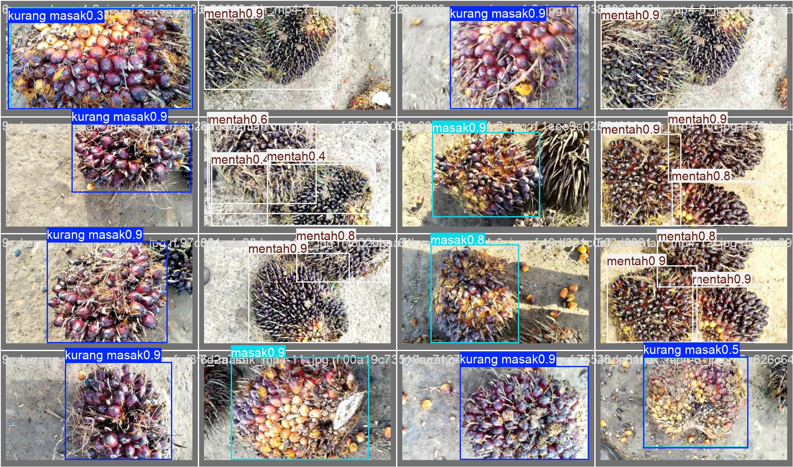
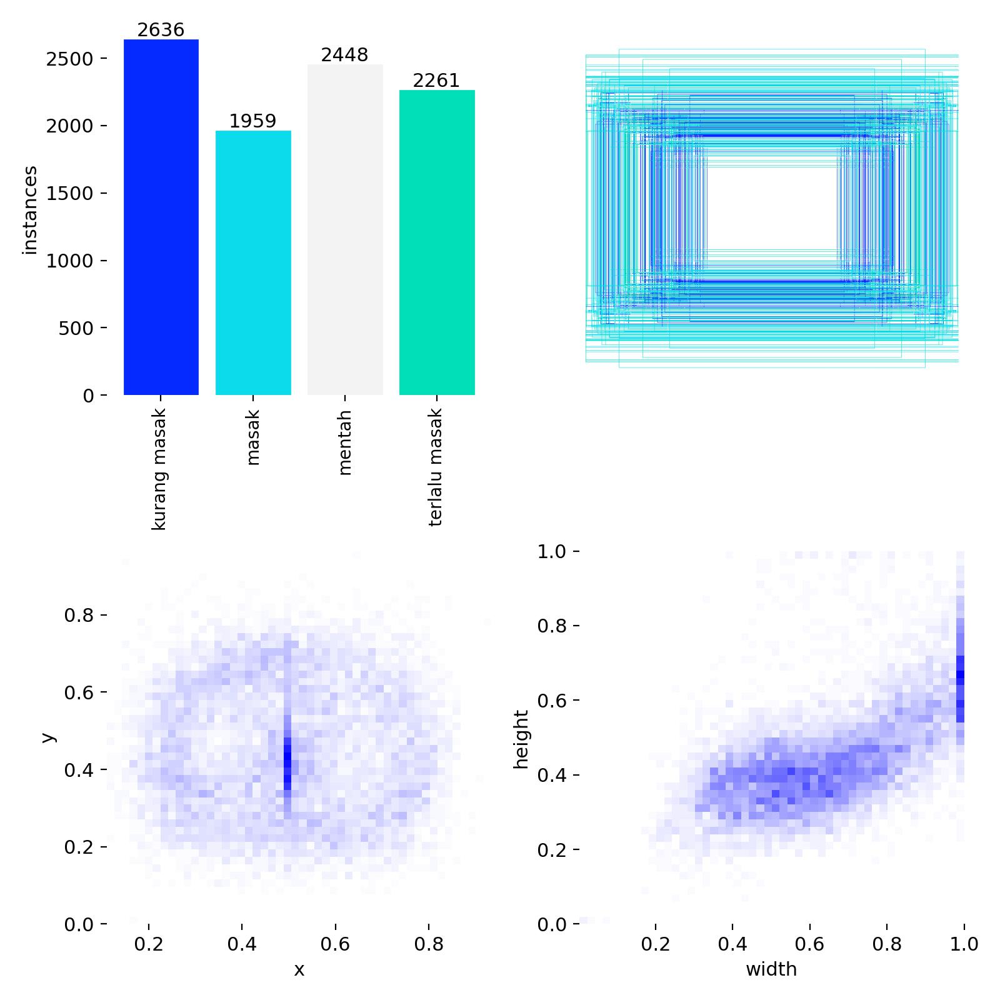
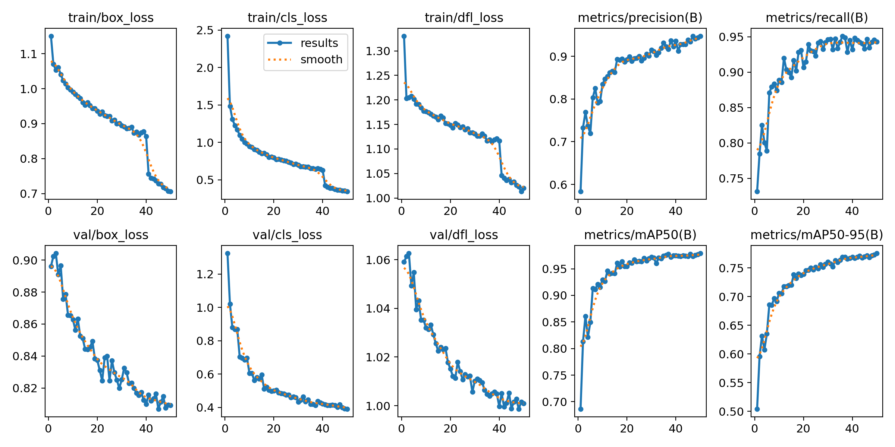
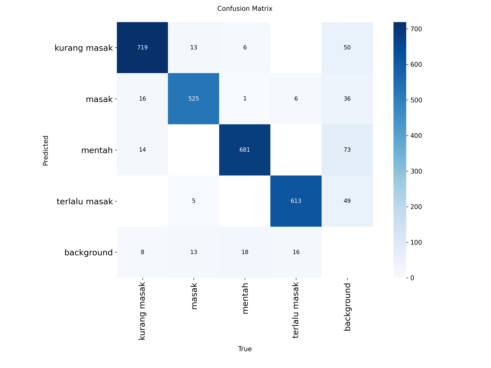
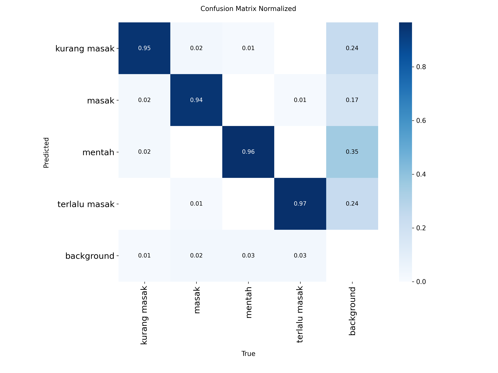
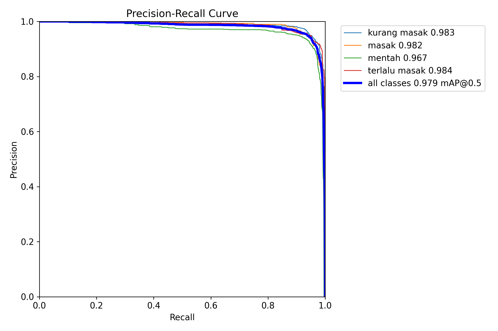
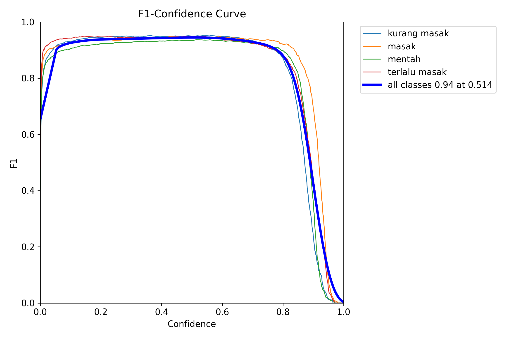
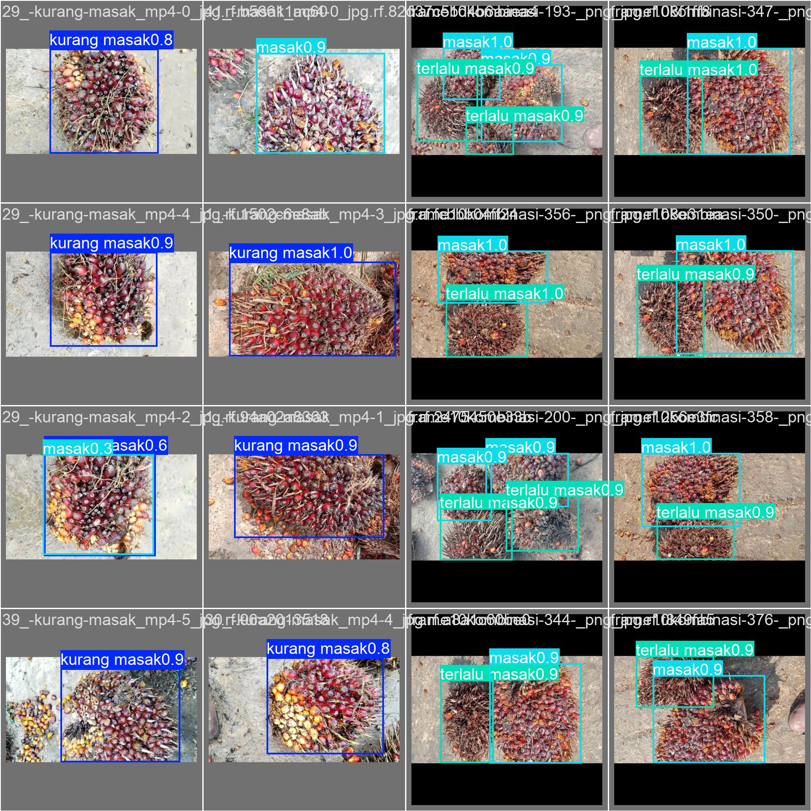

# Dokumentasi Grading TBS Berbasis Computer Vision

Tanggal dokumen: 10 Juni 2026

Run utama: `runs/detect/palm_oil_optimized-2`

## Ringkasan

- Test precision: **93.12%**.
- Test recall: **94.65%**.
- Test mAP50: **97.54%**.
- Test mAP50-95: **76.57%**.
- Optimizer terbaik pada benchmark 20 epoch: **MuSGD**.

## Dataset dan Distribusi Label

| Split | Images | Labels | Label kosong | Total objek | Kurang masak | Masak | Mentah | Terlalu masak |
|---|---|---|---|---|---|---|---|---|
| train | 4.962 | 4.962 | 336 | 9.305 | 2.637 | 1.959 | 2.448 | 2.261 |
| valid | 1.403 | 1.403 | 92 | 2.655 | 757 | 556 | 706 | 636 |
| test | 700 | 700 | 45 | 1.358 | 394 | 271 | 362 | 331 |

## Hyperparameter Tuning dan Training

Benchmark optimizer menjalankan `SGD`, `Adam`, `AdamW`, dan `MuSGD` masing-masing selama 20 epoch. Progress tersimpan di `docs/assets/grading_tph_optimizer_tuning_progress.csv`.

| Optimizer | Status | Best epoch | Precision | Recall | mAP50 | mAP50-95 | Val loss | Score | Durasi |
|---|---|---|---|---|---|---|---|---|---|
| SGD | ok | 20 | 90.01% | 93.42% | 96.33% | 75.33% | 2,272 | 0,391 | 360,5 s |
| Adam | ok | 20 | 88.28% | 89.71% | 94.62% | 73.10% | 2,367 | 0,370 | 370,0 s |
| AdamW | ok | 20 | 86.91% | 93.11% | 95.62% | 73.97% | 2,327 | 0,378 | 371,8 s |
| MuSGD | ok | 20 | 92.17% | 93.01% | 96.90% | 76.27% | 2,256 | 0,399 | 417,0 s |

## Evaluasi Model

Best epoch training final adalah epoch **50** dengan precision **94.68%**, recall **94.29%**, mAP50 **97.91%**, dan mAP50-95 **77.55%**.

| Split | Precision | Recall | mAP50 | mAP50-95 |
|---|---|---|---|---|
| Validasi | 92.31% | 92.82% | 97.12% | 76.45% |
| Test | 93.12% | 94.65% | 97.54% | 76.57% |

| Kelas | mAP50-95 validasi | mAP50-95 test |
|---|---|---|
| kurang masak | 75.41% | 71.87% |
| masak | 82.07% | 84.20% |
| mentah | 72.57% | 74.14% |
| terlalu masak | 75.74% | 76.07% |

## Contoh Prediksi Validasi

## Benchmark Runtime dan Artifact

| imgsz | Samples | Mean | Median | P95 | FPS |
|---|---|---|---|---|---|
| 640 | 50 | 3,074 ms | 3,070 ms | 3,208 ms | 325,3 |
| 1.024 | 50 | 4,089 ms | 4,093 ms | 4,179 ms | 244,6 |

| Format | Ukuran | File |
|---|---|---|
| PyTorch PT | 5,931 MB | best.pt |
| ONNX | 11,691 MB | best.onnx |
| TFLite FP16 | 5,863 MB | best_float16.tflite |
| TFLite FP32 | 11,645 MB | best_float32.tflite |
| TFLite INT8 | Belum dibuat | best_int8.tflite |
| TFLite full integer quant | Belum dibuat | best_full_integer_quant.tflite |
| TFLite integer quant | Belum dibuat | best_integer_quant.tflite |

## Catatan Deployment

Export cepat menggunakan ONNX dan TFLite non-INT8. INT8 sengaja dibuat opsional karena proses kalibrasi dataset lebih lama dan dapat membuat file sementara besar.

## Rekomendasi Lanjutan

- Tambah data lapangan lintas perangkat dan kondisi cahaya.
- Gunakan diagnostic inference untuk gambar tanpa bounding box.
- Jalankan deployment bertahap: ONNX/TFLite cepat dulu, INT8 saat final.
